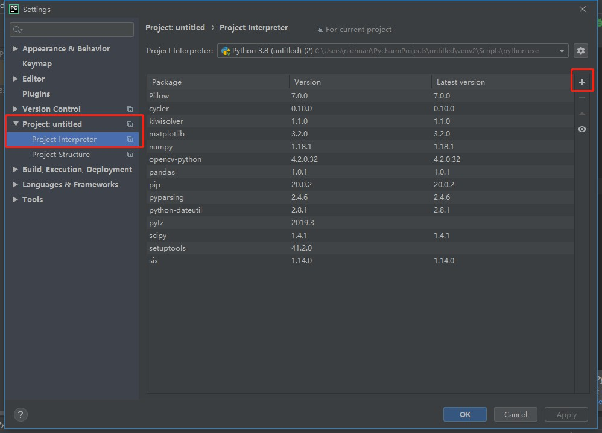
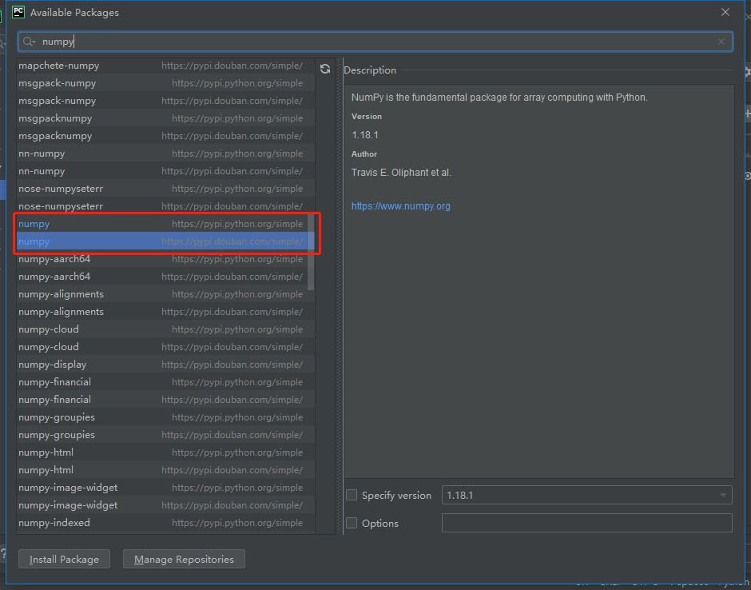

python使用pip下载安装第三方库时经常会遇到下载速度慢的问题，可以利用以下命令更改豆瓣源下载第三方库，可以提高下载速度。

<!-- more -->

<meta name="referrer" content="no-referrer"/>

## 1. pip安装添加豆瓣源

```bash
pip install -i https://pypi.douban.com/simple 包名称	#默认pip安装，如果使用python3，需要替换为pip3
#示例：更换豆瓣源安装numpy
pip install -i https://pypi.douban.com/simple numpy
```

## 2. 将豆瓣源添加到PyCharm第三方库管理的方法

```yaml
点击 File-->Settings-->Project-->Project Interpreter-->"+"-->Manage Repositories
添加 https://pypi.douban.com/simple 
刷新第三方库目录，即可看到豆瓣源的安装目录，点击所需第三方库安装
```




